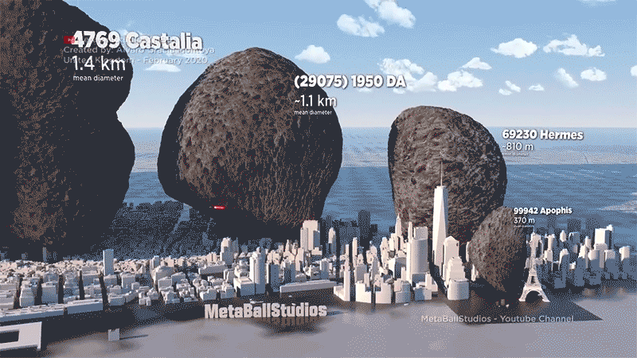

Format: 

The idea for the project was born from the fact that while we were searching for topic we came across a catchy line 
' Asteroid bigger than Burj khalifa to fly by Earth ' 

we thought why not research about this topic and see if it has any connections to machine learning as such 
and this is how we found out our problem statement for the project 

The problem statment being ....
what do we know about asteroid as a common person ?
nothing as such just that they are large ceslistial objects passing by in space and once in a while invading the planet.

But these asteroid are sometime are very resourceful and at the same time very dangerous ... 
But how do we know if they are resourcefull or dangerous 
well we as data scienctist cannot do that .... it is in the domain of an astrophysicist

so what can we do about these asteroids ?
well we can predict the diameter of the asteroid to know if its even worth taking a look at ....
and that is what our project is all about ....predicting the diameter of the asteroid 

What all is out there in space is still a mystery. Scientists are always trying to search for something new in space. While a lot is expected to be discovered, let us look at what has been found.

ASTEROIDS !!
They have always been interesting as current theory suggest that asteroids are planetisimals, the building blocks of planets that were never incorporated into one of the eight planets in our solar system.

So what exactly are asteroids?
By definition asteroids are small, rocky objects that orbit the Sun. Although asteroids orbit the Sun like planets, they are much smaller than planets.

Why are they important?
Well they may tell us about the origins of our solar system, They may help us understand more about the origin of life, We may want to mine near-earth asteroids for metals, They may someday threaten to collide with Earth and many more such reasons.

These questions are very important from our perspective because if the asteroid is made up of some valuable metal, the larger it is the more beneficial it may be to us. Also if the asteroid is large and near to the Earth it may very well prove to be fatal to the planet. This leads to another question which is how do we know which asteroid is large enough to be mined for metals if they do exists or large enough to be dangerous to the planet? Determining the size of the asteroid may lead us to some conclusion about the impact of the asteroid. Size of the asteroid is measured in terms of diameter and predicting the diameter of the asteroid may help us in our quest of approximating the dangers or benefits the asteroids presents to the planet

Terminology
A -> semi-major axis
The semi-major axis of an asteroid is used to describe the dimensions of its orbit around the Sun, and its value determines the minor planet's orbital period.

E -> eccentricity
The axis marked eccentricity is a measure of how far from circular each orbit is. The smaller the eccentricity number is, the more circular the orbit is.

G -> Magnitude slope parameter
It relates to the opposition effect. Its value depends on the way light is scattered by particles on the asteroid’s surface.

I -> Inclination with respect to x-y ecliptic plane (degree)
Orbital inclination measures the tilt of an object's orbit around a celestial body. It is expressed as the angle between a reference plane and the orbital plane or axis of direction of the orbiting object.

Om -> Longitude of the ascending node
It is one of the orbital elements used to specify the orbit of an object in space. It is the angle from a reference direction, called the origin of longitude, to the direction of the ascending node, measured in a reference plane Link: https://en.wikipedia.org/wiki/Longitude_of_the_ascending_node

W -> argument of perihelion
In astronomy, the argument of periapsis (ω) is a way of talking about the orbit of a planet, asteroid or comet. It is also known as the argument of perihelion or the argument of perifocus. It is the angle (starting from the centre of the orbit) between an orbiting body's periapsis and its ascending node Link: https://simple.wikipedia.org/wiki/Argument_of_periapsis

Q -> perihelion distance
The closest distance between asteroid and the sun

Ad -> aphelion distance
The furthest distance between asteroid and the sun

Per_y -> Orbital period
The amount of time asteroid takes to orbit the sun

H -> Absolute Magnitude parameter
An asteroid’s absolute magnitude is the visual magnitude an observer would record if the asteroid were placed 1 Astronomical Unit (au) away, and 1 au from the Sun and at a zero phase angle. Link: https://cneos.jpl.nasa.gov/glossary/h.html

Diameter -> Diameter of asteroid (Km)

rot_per -> Rotation Period(h)

The period of time the asteroid takes to rotate on its axis

Albedo -> geometric albedo
Albedo refers to an object's measure of reflectivity, or intrinsic brightness. Link: https://nssdc.gsfc.nasa.gov/planetary/text/asteroids.txt

GM -> Standard gravitational parameter
The standard gravitational parameter μ of a celestial body is the product of the gravitational constant G and the mass M of the body. https://en.wikipedia.org/wiki/Standard_gravitational_parameter

Neo -> Near Earth Object

Pha -> Physically Hazardous Asteroid

Moid -> Earth Minimum orbit Intersection Distance(au)

Minimum orbit intersection distance (MOID) is a measure used in astronomy to assess potential close approaches and collision risks between astronomical objects.[1][2] It is defined as the distance between the closest points of the osculating orbits of two bodies Link: https://en.wikipedia.org/wiki/Minimum_orbit_intersection_distance
